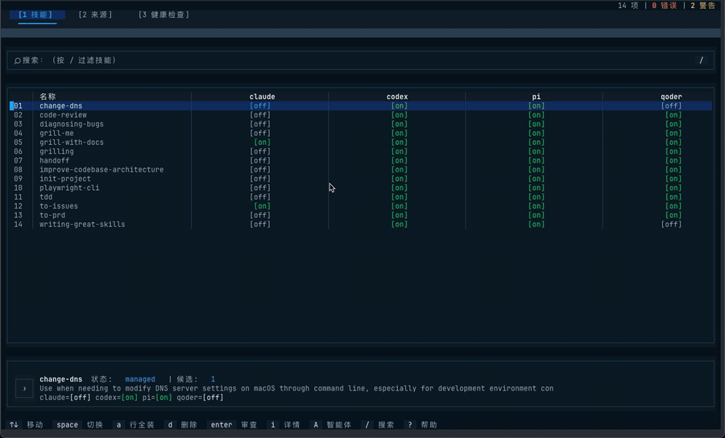

<div align="center">
  <h1>Agent Skills Mesh</h1>
  <p><strong>A three-layer skill manager</strong> · single source of truth + symlink distribution</p>
  <p>Unified skill management for all your AI agents (Claude / Codex / Cursor / Pi …)</p>
  <p>
    
    
    
    
  </p>
  <p>English · <a href="README.md">简体中文</a></p>
</div>

---

Agent Skills Mesh (`asm`) splits skill management into three layers — **where skills come from, where they live, and which agents receive them**. A **single source of truth (SSOT)** stores each skill once; **symlinks** (directory junctions on Windows) distribute it to the agents you enable. Maintain a skill once, share it everywhere — no more duplicate drift.

<p align="center">
  
</p>

> TUI preview (loop): Skill×Agent matrix → skill details → Source management → Doctor health checks

### Features

- **Three-layer model** — `source` (origin) / `skill` (SSOT library) / `agent` (distribution), with clear separation of concerns
- **Single source of truth (SSOT)** — each skill stored once; change it once and every enabled agent stays in sync
- **Symlink / junction distribution** — enable/disable just creates/removes a link (symlink on macOS/Linux, directory junction on Windows): zero-copy, instant
- **Multiple source types** — git repo / local folder / single skill, auto-inferred
- **Full lifecycle** — search, add, update, remove, rebind orphans, batch operations
- **Interactive TUI** — built on [@opentui/solid](https://opentui.com): skill×agent matrix + web-style modal dialogs + fuzzy search
- **Health checks (doctor)** — external / broken-link / orphan / source-missing / conflict, with one-key locate & repair
- **Cross-agent unification** — one skill, enabled into any number of agents on demand
- **Smart + custom agent enablement** — `init` auto-enables agents by install detection; custom agents (any `skills_dir`) with centralized enable/disable/add/remove (built-ins cannot be removed)
- **Bilingual (zh/en)** — defaults to system locale (reads `AppleLanguages` on macOS, handling `$LANG` mismatch); full CLI/TUI coverage; switch via `--lang` / `ASM_LANG` / config / TUI `Shift+L`

### Installation

> [!NOTE]
> `agent-skills-mesh@0.1.2` has been published to npm. The main package installs the matching standalone platform package via `optionalDependencies` (darwin-arm64 / darwin-x64 / linux-x64 / win32-x64).

**npm global install (recommended)**

```bash
npm i -g agent-skills-mesh
asm --help
```

**From source for development**

```bash
git clone https://github.com/xhl592576605/agent-skills-mesh.git
cd agent-skills-mesh
bun install            # requires Bun 1.3+
bun run src/cli/index.ts --help
```

### Quick Start

```bash
asm init                                  # initialize ~/.agent-skills-mesh
asm source add <git-repo-or-folder>       # add a skill source (repo/folder/skill auto-inferred)
asm refresh                               # scan sources, build the index
asm skill search <keyword>                # search indexable skills
asm skill add <name>                      # copy a skill from source into the SSOT
asm skill enable <name> --agent claude    # enable: SSOT → agent symlink
asm tui                                   # open the interactive TUI
```

### Usage

#### CLI (three layers)

| Layer | Command | Description |
|---|---|---|
| Top | `init` | Initialize home (config / index / state) |
| | `refresh` | Scan sources, rebuild the index |
| | `doctor` | Health checks + repair hints |
| | `tui` | Interactive TUI |
| **source** | `add <target>` | Add a source (repo/folder/skill auto-inferred; `--branch`/`--type` optional) |
| | `update [id]` | Pull/rescan sources, report updatable skills (does not overwrite SSOT) |
| | `remove <id>` | Remove a source (keeps orphans by default; `--purge` cascades) |
| | `list` | List sources |
| | `enable` / `disable <id>` | Enable / disable a source |
| **skill** | `search [query]` | Fuzzy search (name / displayName / description / tags) |
| | `add <name>` | Copy from source into the SSOT (`--source <id>` when multiple sources provide it) |
| | `list` / `info <name>` | List / show details |
| | `update [name]` | Update to the source's latest version (`--all` for all) |
| | `remove <name>` | Remove from SSOT + detach all agent symlinks |
| | `rebind <name> --source <id>` | Re-associate an orphan/existing skill with a source |
| | `enable` / `disable <name> --agent <id>` | Enable / disable: create / remove an agent symlink |

#### TUI

```bash
asm tui
```

Three tabs (`1`/`2`/`3` to switch):

| Tab | Content | Key actions |
|---|---|---|
| **Skill×Agent** | skill×agent matrix, cells `[on]`/`[off]`/`[!]` | `space` toggle · `a`/`d` batch row · `enter` review · `i` details |
| **Source** | source list | `a` add · `u` update · `d` remove · `e`/`x` enable/disable |
| **Doctor** | health issues + adoptable candidates | `f` fix selected · `F` fix all |

| Key | Action |
|---|---|
| `1` / `2` / `3` / `Tab` | Switch / cycle tab |
| `↑` `↓` `←` `→` / `h j k l` | Move cursor |
| `space` | Toggle cell (install / uninstall) |
| `enter` | Review pending (apply after dialog confirms) |
| `a` | Install whole row (all agents) |
| `A` (Shift+a) | Open agent manager dialog |
| `d` | Delete current skill (SSOT + symlinks) |
| `i` | Skill details |
| `/` | Fuzzy search |
| `L` (Shift+l) | Toggle zh / en |
| `ctrl + r` | Global refresh (rescan) |
| `?` | Help |
| `ESC` / `ctrl + c` | Close dialog / quit |

> Inside the agent manager dialog: `space` enable/disable agent · `a` add custom agent · `d` remove agent (built-ins cannot be removed)

> [!TIP]
> Every write operation (add / remove / enable / repair) pops up a **web-style modal confirmation** (semi-transparent overlay); cancel with `ESC`, clicking the overlay, or `ctrl+c`.

### How It Works

```
┌─────────── source (origin) ─────────┐
│ git repo / folder / skill            │
└───────────────┬──────────────────────┘
                │ refresh scans
                ▼
┌─────────── skill (SSOT) ────────────┐
│ ~/.agent-skills-mesh/skills/<name>   │   ← single source of truth, stored once
└───────────────┬──────────────────────┘
                │ enable (creates a symlink)
                ▼
┌─────────── agent (distribution) ────┐
│ claude / codex / pi …                │   ← symlink points to the SSOT
│ ~/.agent/skills/<name>               │
└──────────────────────────────────────┘
```

- **source** = where skills come from (remote repos, local dirs)
- **skill** = where they live (SSOT, centrally managed)
- **agent** = who receives them (symlinked into each agent's skills dir)

Each skill lives once in the SSOT; agents reference it via symlink and always see the latest version. Update the SSOT and every enabled agent picks it up.

### Configuration

`~/.agent-skills-mesh/config.toml`:

```toml
[agents.claude]
name = "Claude"
skills_dir = "~/.agent/skills"      # symlink target
enabled = true

[agents.codex]
name = "Codex"
skills_dir = "~/.codex/skills"
enabled = true

# configure as many agents as you need …
```

#### Language

The UI supports Chinese (zh-CN) and English (en), defaulting to system locale (Chinese system → zh-CN, others → en).

- **CLI**: `asm --lang zh skill list` (or `--lang en` / `--lang auto`); or set `ASM_LANG=zh`
- **TUI**: press `L` (Shift+l) at runtime to toggle zh/en instantly; preference is persisted to config
- **config**: `settings.language = "zh-CN" | "en" | "auto"` (default `auto`; manual setting takes precedence)

Priority: `--lang` flag > `ASM_LANG` > `config.language` > system locale > `en`

### License

MIT
